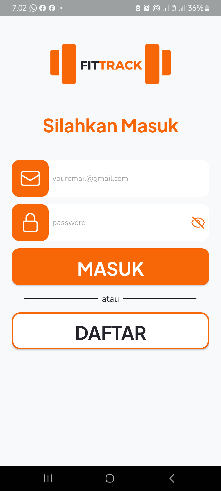
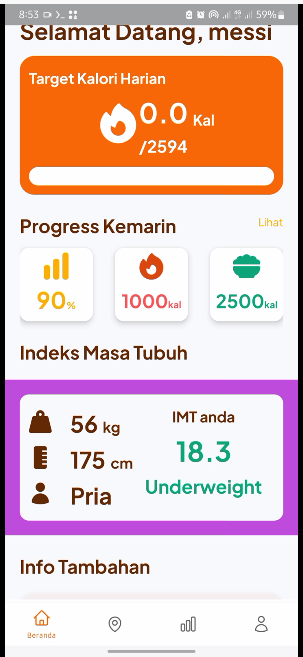
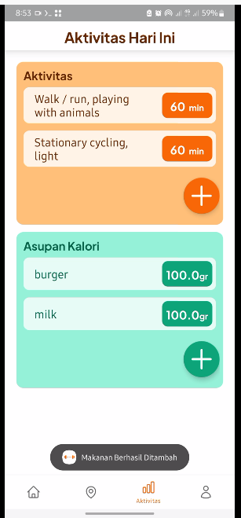

# Fit Track

<p align="center">
  
  
  
</p>

## Description
Fit Track is an application designed for tracking daily calories and activities. It allows users to log their food and drink intake, as well as daily activities. The app also includes customizable targets to help users with their diet goals, whether it's losing weight, gaining weight, or maintaining their current weight.

## Features
- Log food and drink consumption
- Record daily activities
- Set and track diet goals for weight loss, weight gain, or maintenance

## Technologies Used
- Kotlin
- Android Studio
- Retrofit

## Installation
1. Clone the repository:
    ```bash
    git clone https://github.com/OwariYagami/FitTrack-app.git
    ```
2. Open the project in Android Studio
3. Build and run the project on an emulator or physical device

## Usage
1. Launch the app on your device.
2. Create an account or log in if you already have one.
3. Use the app to log your meals, drinks, and activities throughout the day.
4. Set and adjust your fitness targets according to your personal goals.
5. Monitor your progress and make adjustments to your routine as needed.

## Contributing
1. Fork the repository
2. Create a new branch:
    ```bash
    git checkout -b feature-branch
    ```
3. Commit your changes:
    ```bash
    git commit -m 'Add some feature'
    ```
4. Push to the branch:
    ```bash
    git push origin feature-branch
    ```
5. Open a Pull Request

## License
This project is licensed under the MIT License - see the [LICENSE](LICENSE) file for details.
